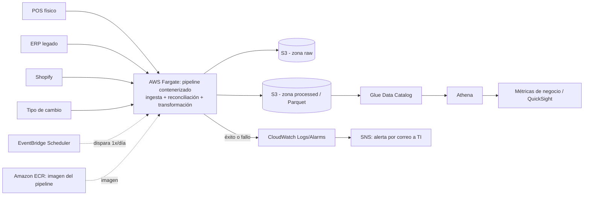

# Propuesta de Arquitectura AWS — CaféNorte

**Para:** Dirección general y Dirección de TI de CaféNorte · **Fecha:** 2026-09

## 1. Objetivo

**Lo que obtiene el dueño de CaféNorte:** una vista consolidada y actualizada automáticamente de ventas (tiendas y e-commerce) e inventario, con las cuatro métricas acordadas: rotación de inventario, quiebres de stock, crecimiento mensual de ventas por canal y productos con margen negativo.

Se lleva a AWS el pipeline ya construido y probado localmente (Python, pandas, DuckDB, 41 pruebas) que consolida POS, ERP, Shopify y tipo de cambio. **Costo estimado: USD 35–42/mes, muy por debajo del techo de USD 200/mes.**

## 2. Arquitectura propuesta

| Servicio | Propósito y justificación |
|---|---|
| **S3** | Zonas `raw` y `processed` (Parquet); costo casi nulo, versionado. |
| **Fargate (ECS)** | Mismo contenedor del pipeline; se paga solo por minutos de la corrida diaria. |
| **ECR** | Registro de la imagen (lifecycle policy). |
| **EventBridge Scheduler** | Dispara la corrida diaria; sin orquestación compleja. |
| **Glue Data Catalog** | Solo esquema de las tablas; sin crawlers. |
| **Athena** | SQL sobre Parquet, sin servidor; pago por dato escaneado. |
| **QuickSight** | Dashboards sobre Athena; costo por usuario. |
| **CloudWatch + SNS** | Logs, alarma y correo a TI si falla o se demora la corrida. |
| **Parameter Store + IAM** | Credenciales `SecureString` y roles de mínimo privilegio; sin costo. |

No se proponen EMR, Redshift, EKS, EC2 permanente ni streaming: el volumen (~230K filas en la tabla mayor) y la ausencia de tiempo real no lo justifican.

## 3. De local a producción

Se conservan las definiciones de negocio, las reglas de conciliación y las pruebas. Las 41 pruebas unitarias validan el código y corren en CI antes de publicar la imagen; en cada ejecución, las validaciones de integridad (fallan rápido ante tasas de cambio faltantes, mapeos de producto conflictivos o costos sin resolver) protegen los datos y disparan la alerta por SNS.

Cambia la persistencia: de DuckDB local a Parquet en S3, consultado con Glue/Athena. Las consultas usan construcciones específicas de DuckDB (series de meses, `UNNEST`) que deben adaptarse a Athena/Trino y validarse contra los resultados actuales: es portabilidad, no rediseño de la lógica de negocio.

## 4. Estimación de costo mensual

Supuestos: 4 fuentes, ~96K transacciones, ~231K registros de inventario, 1 corrida diaria.

| Servicio | Supuesto de uso | USD/mes |
|---|---|---|
| S3 (raw + processed, versionado) | ~10–20 GB, $0.023/GB | ~$0.50 – $1 |
| Fargate | 1 corrida/día × ~15–30 min, 1 vCPU / 2 GB | ~$2 – $5 |
| ECR | ~1–2 GB con lifecycle | ~$0.10 – $0.20 |
| Glue Data Catalog | 6 tablas, sin crawlers | ~$0 |
| Athena | ~50–100 GB escaneados/mes, $5/TB | ~$0.25 – $1 |
| CloudWatch (logs + 2-3 alarmas) | Volumen bajo | ~$1 – $2 |
| SNS, Parameter Store, IAM | Nivel estándar | ~$0 |
| **Subtotal infraestructura** | | **≈ 5 – 12** |
| **QuickSight** | 1 Author ($24) + 2 Readers ($3 c/u) | **≈ 30**, según usuarios |
| **Total estimado** | | **≈ 35 – 42** |

Tarifas públicas de AWS (us-east-1). Fargate es un rango porque el pipeline aún no se ha ejecutado en AWS; se medirá en la Fase 1.

**Red (NAT Gateway):** el estimado no lo incluye. Si Fargate debe correr en subredes privadas con salida a fuentes externas, sumar ~USD 33–40/mes más cargos menores de datos; aun así se permanece dentro de USD 200/mes.

## 5. Plan de implementación por fases

- **Fase 1 — Ingesta y fundamento analítico:** S3, Fargate vía EventBridge, Glue + Athena, logs y alerta de falla. Primero, porque reproduce en la nube el pipeline ya validado.
- **Fase 2 — Reporte automatizado:** dashboards QuickSight sobre Athena (Reader para dirección, Author para TI). Después, porque el BI requiere datos ya confiables.
- **Fase 3 — Endurecimiento y escalamiento:** lifecycle de S3, afinamiento de alarmas, particionado en Athena e ingesta incremental si crece el volumen.

## 6. Riesgos y mitigación (top 5)

| Riesgo | Mitigación |
|---|---|
| Semántica de `tipo_comprobante` no definida | Confirmar con CaféNorte antes de filtrar o revertir signo; mientras tanto se cuenta todo valor tal cual llega. |
| `costo_mxn` asumido como costo unitario | Confirmar con el dueño del ERP; reproceso barato porque el crudo se conserva en S3. |
| ~54% de unidades sin serie de inventario observable | No se asume quiebre ni error; mejorar la cobertura del ERP es decisión de negocio. |
| Calidad del ERP legado / cambios de esquema | Zona `raw` versionada; el pipeline falla rápido y alerta por SNS. |
| Dependencia del tipo de cambio en e-commerce | `exchange_rates` como fuente de primer nivel; el cálculo falla si falta una tasa requerida. |

## 7. Supuestos

- Una corrida diaria por lote basta para el alcance inicial.
- El volumen actual sigue siendo pequeño para una arquitectura serverless/batch ligera.
- El estimado de QuickSight usa 1 Author + 2 Readers.
- El NAT Gateway es condicional a los requisitos de red/seguridad del cliente.

## 8. Preguntas abiertas para CaféNorte

- ¿Mecanismo real de entrega por fuente (API, SFTP, manual) para POS, ERP, Shopify y tipo de cambio? (define si se necesita NAT Gateway).
- ¿Quién confirma la definición autoritativa de `tipo_comprobante`?
- ¿Se confirma que `costo_mxn` es costo unitario y no total o por lote?
- ¿Cuántos usuarios y de qué tipo (Author vs. Reader) usarán el dashboard? (impacta el costo).
- ¿Los datos contienen información identificable de clientes que requiera cifrado o manejo adicional de privacidad?
