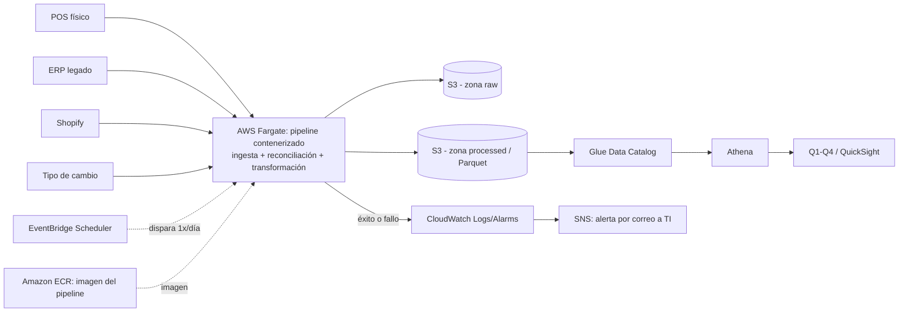

# Propuesta de Arquitectura AWS — CaféNorte

**Para:** Dirección general y Dirección de TI de CaféNorte
**De:** Propuesta técnica de infraestructura de datos
**Fecha:** 2026-09

## 1. Objetivo

Llevar a producción, en AWS, el pipeline analítico ya construido y probado localmente (Python, pandas, DuckDB, 36 pruebas automatizadas) que consolida ventas físicas (POS), inventario/costos (ERP), pedidos de e-commerce (Shopify) y tipo de cambio, y responde las preguntas de negocio Q1–Q4. La meta es una arquitectura administrada, de bajo costo fijo y bajo esfuerzo operativo, que reutilice la lógica ya validada sin rediseñarla.

**Esta arquitectura resuelve el problema actual por menos de USD 200/mes y permite crecer sin introducir complejidad innecesaria.**

## 2. Arquitectura propuesta

| Servicio | Propósito | Por qué encaja en esta escala | Trade-off principal |
|---|---|---|---|
| **Amazon S3** | Zona `raw` (copia inmutable de cada fuente tal como llega) y zona `processed` (tablas analíticas en Parquet). | Costo casi nulo a este volumen (decenas de GB), sin servidores que administrar, versionado nativo para auditar/reprocesar. | Ninguna consulta directa: siempre requiere un motor (Athena) encima. |
| **AWS Fargate (ECS)** | Ejecuta el mismo contenedor Python/pandas/DuckDB del pipeline actual (`load → reconcile → transform → persist`), sin reescritura. | Solo se paga por minutos de ejecución real (una corrida diaria de pocos minutos); sin clúster ni EC2 permanente. | Arranque en frío de ~30–60 s por corrida; irrelevante en un batch diario. |
| **Amazon ECR** | Almacena la imagen del contenedor ejecutado por Fargate. | El pipeline necesita un registro de imágenes para desplegarse de forma reproducible; a esta escala el costo es de centavos. | Conviene aplicar una política de lifecycle para no acumular versiones antiguas innecesariamente. |
| **Amazon EventBridge Scheduler** | Dispara la corrida diaria del pipeline (reemplaza ejecutar `run_pipeline.py` a mano). | Sin infraestructura, costo prácticamente cero para 1 disparo/día. | No es apto para orquestar dependencias complejas entre muchos pasos (no se necesita aquí). |
| **AWS Glue Data Catalog** | Registra el esquema de las tablas analíticas (`dim_product`, `dim_store`, `fact_sales`, etc.) sobre S3. | Solo se usa como catálogo de metadatos (no Glue ETL ni crawlers recurrentes); esquema definido una vez porque lo produce nuestro propio código. | Si el esquema de salida cambia, hay que actualizar la definición manualmente (bajo riesgo: el esquema lo controla el propio pipeline). |
| **Amazon Athena** | Motor SQL serverless sobre las tablas Parquet; equivalente en producción a las consultas DuckDB de `business_questions.py`. | Sin servidor que mantener, se paga por dato escaneado; volumen de este proyecto es mínimo. | Costo puede crecer si se escanean tablas completas sin partición/columnar; se mitiga porque ya se persiste en Parquet. |
| **Amazon QuickSight** | Capa de consumo de negocio (dashboards para Q1–Q4) sobre Athena. | Modelo por usuario, sin licenciamiento de servidor BI; adecuado para un puñado de usuarios internos. | Es el único costo que escala con número de usuarios (ver sección de costos). |
| **Amazon CloudWatch (Logs + Alarms)** | Centraliza logs de cada corrida y dispara una alarma si el pipeline falla o tarda de más. | Volumen de logs muy bajo (dentro de capa gratuita en la práctica). | Requiere definir umbrales razonables para no generar ruido de alertas. |
| **Amazon SNS** | Envía correo a TI cuando la corrida falla (manejo de fallas / calidad de datos). | Prácticamente gratis a este volumen de notificaciones. | Es notificación simple, no un motor de validación de calidad de datos. |
| **AWS Systems Manager Parameter Store** | Guarda credenciales (token de Shopify, etc.) como `SecureString`. | Gratis en el nivel estándar; evita credenciales en código o variables planas. | Sin rotación automática (si se requiere rotación, el paso natural es migrar a Secrets Manager). |
| **AWS IAM** | Roles de mínimo privilegio para la tarea de Fargate, Athena y QuickSight. | Sin costo; requisito base de seguridad, no un extra. | Requiere mantenimiento cuidadoso al añadir nuevos servicios. |

No se propone EMR, clústeres de Redshift, Kubernetes/EKS, flotas EC2 permanentes ni arquitectura de streaming: el volumen actual (la tabla más grande tiene ~230K filas) y la ausencia de un requisito de tiempo real no lo justifican.

## 3. Mapeo local → producción

| Componente local actual | Equivalente en producción AWS | Qué cambia / qué no |
|---|---|---|
| Archivos `data/raw/*.csv/json/parquet` | S3 (zona `raw`) | Cambia el **almacenamiento y la forma de llegada** (API/archivo → S3); el formato y contenido de cada fuente no se reinterpreta. |
| `python scripts/run_pipeline.py` ejecutado a mano | EventBridge Scheduler + tarea Fargate con el mismo contenedor | Cambia la **programación** (manual → automática diaria); la lógica de `load.py`, `reconcile.py`, `transform.py` **no cambia**. |
| `cafenorte.duckdb` (archivo local) | Tablas Parquet en S3 + Glue Data Catalog + Athena | Cambia el **motor de persistencia/consulta** (archivo único → almacenamiento distribuido + SQL serverless); las **definiciones analíticas y reglas de reconciliación permanecen iguales**. |
| `business_questions.py` (Q1–Q4) | Mismas consultas, ejecutables vía Athena y expuestas en QuickSight | La **lógica de negocio de Q1–Q4 no se reinterpreta**; solo cambia dónde se ejecuta la consulta. |
| 36 pruebas (`tests/`) | Se mantienen como gate de calidad antes de desplegar una nueva versión del contenedor | Sin cambios en las pruebas; se ejecutan en CI antes de publicar la imagen usada por Fargate. |
| Ejecución y revisión manual de resultados | CloudWatch (logs) + SNS (alertas) | Se agrega **observabilidad y alerta automática**, algo que no existía en el flujo local. |

## 4. Estimación de costo mensual

Supuestos de escala (consistentes con los datos del reto): 4 fuentes, ~96K transacciones de venta y ~231K registros de inventario acumulados a la fecha, 1 corrida completa por día, sin requisito de tiempo real.

| Servicio | Supuesto de uso | Estimado mensual (USD) |
|---|---|---|
| S3 (raw + processed, con versionado) | ~10–20 GB totales, a $0.023/GB | ~$0.50 – $1 |
| Fargate | 1 corrida/día × ~15–30 min, 1 vCPU / 2 GB | ~$2 – $5 |
| ECR | ~1–2 GB de imágenes con política de lifecycle | ~$0.10 – $0.20 |
| Glue Data Catalog | Catálogo de 6 tablas, sin crawlers recurrentes | ~$0 (dentro de capa gratuita) |
| Athena | ~50–100 GB escaneados/mes (consultas Q1-Q4 + refresco de dashboard), a $5/TB | ~$0.25 – $1 |
| CloudWatch (logs + 2-3 alarmas) | Volumen bajo de logs de una corrida diaria | ~$1 – $2 |
| SNS | <100 notificaciones/mes | ~$0 |
| Parameter Store, IAM | Nivel estándar | $0 |
| **Subtotal infraestructura recurrente** | | **≈ USD 5 – 12/mes** |
| **QuickSight (BI, costo por usuario)** | 1 Author (TI, $24/mes) + 2 Readers ($3/mes c/u) | **≈ USD 30/mes**, variable según número de usuarios |
| **Total estimado** | | **≈ USD 35 – 45/mes**, muy por debajo del techo de USD 200/mes |

**Supuesto de red:** el estimado base no contempla un NAT Gateway permanente. Si la política de seguridad de CaféNorte exige ejecutar Fargate en subredes privadas y acceder a fuentes externas mediante NAT Gateway, debe presupuestarse aproximadamente USD 33–40/mes adicionales por gateway, más cargos menores de procesamiento de datos. Esta decisión dependerá del mecanismo real de entrega de POS, ERP, Shopify y tipo de cambio. Incluso bajo este escenario, la solución permanece dentro del límite de USD 200/mes.

Notas sobre precisión: los costos se estimaron con tarifas públicas de AWS para us-east-1 y con supuestos de uso acordes al volumen actual del reto. El rango de Fargate es deliberadamente conservador porque la duración real de cada corrida aún no se ha medido en producción. ECR agrega un costo marginal para almacenar la imagen del pipeline. QuickSight es el componente cuyo costo crece principalmente con el número de usuarios, por lo que debe confirmarse cuántos usuarios serán Authors y cuántos Readers. El costo de red también dependerá de si TI requiere NAT Gateway para la salida a Internet de tareas privadas.

## 5. Plan de implementación por fases

**Fase 1 — Ingesta confiable y fundamento analítico.** Entregable: buckets S3, pipeline actual contenerizado y corriendo en Fargate vía EventBridge Scheduler, catálogo Glue + Athena sobre las tablas analíticas, logs y alerta de falla por correo. Va primero porque reproduce en la nube, con bajo riesgo, el pipeline ya validado localmente, antes de invertir en una capa de consumo.

**Fase 2 — Reporte automatizado / consumo de negocio.** Entregable: dashboards en QuickSight sobre Athena para Q1–Q4, con acceso para dirección (Reader) y TI (Author). Va después porque solo tiene sentido pagar la capa de BI una vez que los datos subyacentes ya corren de forma confiable y automática.

**Fase 3 — Endurecimiento y escalamiento incremental.** Entregable: políticas de ciclo de vida en S3 (mover histórico antiguo a almacenamiento más económico), afinamiento de alarmas/umbrales, revisión de particionado en Athena y de patrones de ingesta incremental si el volumen crece. Va al final porque requiere observar el comportamiento real en producción antes de optimizar.

## 6. Riesgos y mitigación

| Riesgo | Mitigación |
|---|---|
| Semántica de `tipo_comprobante` no está definida por la fuente | Confirmar con CaféNorte antes de introducir filtrado o reversión de signo; mientras tanto se sigue contando todo valor tal como se recibe. |
| `costo_mxn` se trata como costo unitario, sin confirmación explícita de la fuente | Confirmar con el dueño del ERP; si el supuesto cambia, el reproceso es barato porque los datos crudos se conservan en S3. |
| ~54% de las unidades físicas quedan fuera del cálculo de rotación por falta de serie de inventario observable | No se les asigna un significado no soportado (no se asume quiebre ni error); mejorar la cobertura de inventario del ERP es una decisión de negocio, no técnica. |
| E-commerce no tiene dimensión de tienda física | Se reporta a nivel canal/SKU; no se infiere tienda o centro de fulfillment. |
| Calidad de datos del ERP legado / cambios de esquema en las fuentes | Zona `raw` versionada conserva cada entrega tal cual llegó; el pipeline falla rápido (código de salida ≠ 0) y alerta por SNS en vez de transformar datos sospechosos silenciosamente. |
| Dependencia de tipo de cambio para ingresos de e-commerce | Se mantiene `exchange_rates` como fuente de primer nivel, con el mismo cruce por fecha+moneda ya validado; monitorear tasas faltantes en cada corrida. |
| Costo de QuickSight crece con el número de usuarios | Controlar el acceso por rol (Reader vs Author) y revisar la lista de usuarios periódicamente. |

## 7. Preguntas abiertas antes de firmar

- ¿Cuál es el mecanismo real de entrega de cada fuente en producción (API, SFTP, exportación manual) para POS, ERP, Shopify y tipo de cambio?
- ¿Qué frecuencia de actualización requiere el negocio (¿basta una corrida diaria nocturna?)?
- ¿Quién en CaféNorte puede confirmar la definición autoritativa de `tipo_comprobante`?
- ¿Se confirma que `costo_mxn` es costo unitario y no costo total o por lote?
- ¿Existe un modelo de inventario/fulfillment planeado para e-commerce a futuro?
- ¿Cuántos años de histórico deben conservarse (retención)?
- ¿Cuántos usuarios y de qué tipo (autor vs. solo lectura) consumirán el dashboard?
- ¿Qué latencia de datos es aceptable para el negocio?
- ¿Los datos de venta o pedidos contienen información identificable de clientes que requiera cifrado o manejo adicional de privacidad?
