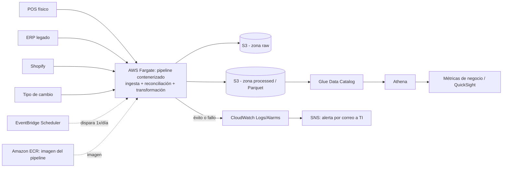

# Propuesta de Arquitectura AWS - CaféNorte

**Para:** Dirección general y Dirección de TI de CaféNorte  
**Fecha:** 2026-09

## 1. Objetivo

CaféNorte obtiene una vista consolidada de ventas físicas y e-commerce, junto con el inventario observable de tiendas físicas, para responder las cuatro métricas acordadas: rotación de inventario, quiebres de stock, crecimiento mensual por canal y productos con margen negativo.

El alcance de inventario no es omnicanal. Shopify identifica producto y unidades vendidas, pero no qué tienda, almacén o pool de inventario surtió cada orden. Por ello, el inventario del ERP se trata como inventario físico y no se atribuye a Shopify.

La propuesta lleva a AWS el pipeline ya validado localmente con Python, pandas y DuckDB, manteniendo un diseño batch proporcional al volumen actual y al límite de **USD 200/mes**.

## 2. Arquitectura propuesta

| Servicio | Propósito |
|---|---|
| **S3** | Zonas `raw` y `processed`, versionadas, privadas y cifradas. |
| **Fargate (ECS)** | Ejecuta el pipeline contenerizado solo durante la ejecución batch. |
| **ECR + EventBridge** | Imagen del pipeline y ejecución diaria programada. |
| **Glue + Athena** | Catálogo y consultas SQL serverless sobre Parquet. |
| **QuickSight** | Dashboard sobre Athena; SPICE cuando convenga reducir consultas repetidas. |
| **CloudWatch + SNS** | Logs, métricas y alerta a TI ante fallo o ausencia de ejecución exitosa. |
| **Parameter Store + IAM + CloudTrail** | Secretos, mínimo privilegio y auditoría. |

No se proponen EMR, Redshift, EKS, EC2 permanente, streaming ni Iceberg en la fase inicial: el volumen actual y una actualización diaria no justifican esa complejidad.

## 3. Ingesta, publicación y operación

El mecanismo real de entrega de POS, ERP, Shopify y tipo de cambio debe confirmarse. Para mantener el presupuesto se priorizan cargas a S3, APIs o conexiones salientes desde Fargate. Si una fuente usa SFTP, se evaluará conectar Fargate al SFTP existente o depositar archivos en S3. Un servidor SFTP permanente de AWS Transfer Family no se incluye en el costo base: en `us-east-1` ronda **USD 216/mes** antes de transferencia y superaría por sí solo el presupuesto.

Cada ejecución escribe primero en un prefijo versionado de S3 y publica la nueva versión de `processed` únicamente después de completar transformaciones y validaciones. Así se evitan lecturas parciales y se habilitan ejecuciones idempotentes y reprocesos por fecha.

Las pruebas corren en CI antes de publicar la imagen. En ejecución, el pipeline falla rápido ante tasas de cambio faltantes, mapeos conflictivos o costos sin resolver. La persistencia cambia de DuckDB a Parquet/S3; el SQL específico de DuckDB se adapta a Athena/Trino y se valida contra los resultados actuales.

## 4. Estimación de costo mensual

**Referencia:** tarifas públicas de `us-east-1`. La región productiva se confirma con CaféNorte según residencia de datos, disponibilidad y costo; `mx-central-1` es una alternativa a evaluar si se requiere residencia en México.

Supuestos: 4 fuentes, ~96K transacciones, ~231K registros de inventario y 1 ejecución diaria de 15-30 min con 1 vCPU / 2 GB.

| Servicio | USD/mes aprox. |
|---|---:|
| S3 | < 1 |
| Fargate | 0.4 - 0.8 |
| ECR | 0.1 - 0.2 |
| Glue Data Catalog | ~0 |
| Athena | < 1 |
| CloudWatch + SNS + CloudTrail | 1 - 3 |
| **Subtotal infraestructura, con margen** | **~3 - 8** |
| **QuickSight: 1 Author + 2 Readers estándar** | **~30** |
| **Total estimado** | **~33 - 38** |

QuickSight se limita a roles **Author/Reader estándar**. No se habilitan usuarios Pro ni Topics/Dashboard Q&A que activen la tarifa adicional de **USD 250/mes por cuenta**.

Athena usa un workgroup con límites de datos escaneados y lifecycle para resultados. El estimado no incluye NAT Gateway; si la política de seguridad exige subred privada con salida a Internet, ese costo se evalúa por separado.

## 5. Plan de implementación

- **Fase 1 - Fundamento:** Terraform, ambientes separados de desarrollo y producción, S3, ECR, Fargate/EventBridge, IAM, CloudWatch/SNS e ingesta por fuente.
- **Fase 2 - Capa analítica:** publicación versionada de Parquet, Glue, Athena, adaptación/validación de Q1-Q4 y controles de escaneo.
- **Fase 3 - Consumo y endurecimiento:** QuickSight, SPICE cuando aplique, alarmas, backfills, lifecycle y optimización si crece el volumen.

La duración se estima después de confirmar mecanismos de entrega y controles de seguridad existentes.

## 6. Riesgos y mitigación

| Riesgo | Mitigación |
|---|---|
| `tipo_comprobante` sin semántica confirmada | Validar con CaféNorte antes de filtrar o invertir signo. |
| `costo_mxn` asumido como costo unitario | Confirmar con el dueño del ERP; el raw versionado permite reprocesar. |
| 54.17% de unidades físicas de Q1 sin serie de inventario observable | No asignar significado sin evidencia; mejorar cobertura con TI. |
| Shopify sin inventario/fulfillment atribuible | No inferir tienda o pool de inventario; mantener poblaciones separadas donde corresponda. |
| Cambios de esquema o fuentes incompletas | Validaciones fail-fast, publicación atómica y alerta; conservar la versión previa. |

## 7. Supuestos y preguntas abiertas

**Supuestos:** una ejecución diaria cubre el alcance inicial; el volumen sigue siendo adecuado para serverless/batch; S3 permanece privado y cifrado; QuickSight usa roles estándar; la región productiva se decide después de validar residencia, disponibilidad y costo.

**Preguntas abiertas:**
- ¿Cómo entrega cada fuente sus datos: API, SFTP, carga manual u otro mecanismo?
- ¿Existe una fuente que identifique el inventario o ubicación que abastece Shopify?
- ¿Quién confirma `tipo_comprobante` y que `costo_mxn` es costo unitario?
- ¿Cuántos usuarios consumirán el dashboard y requieren funciones Pro?
- ¿Existe requisito de residencia de datos en México?
- ¿Quién atiende alertas y cuál es la ventana diaria esperada de disponibilidad?
